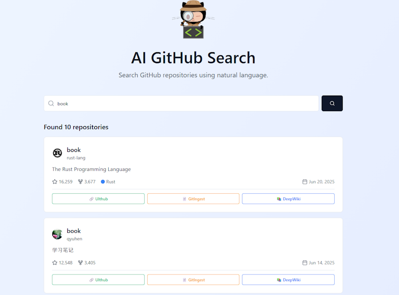
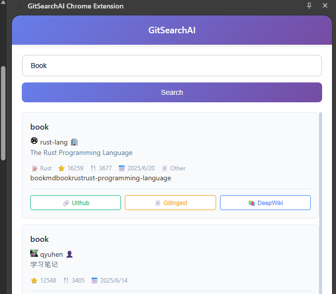

# GitSearchAI Chrome Extension

A Chrome extension that enhances the GitSearchAI.com website by adding convenient access to additional repository analysis tools. This extension integrates external services directly into the GitSearchAI interface for seamless repository exploration.

## 🚀 Features

### Core Functionality
- **GitSearchAI.com Integration**: Seamlessly integrates with the GitSearchAI.com platform
- **External Service Links**: Quick access to repository analysis tools
- **Side Panel Interface**: Convenient side panel for GitSearchAI.com access
- **Cross-Browser Compatibility**: Supports Chrome, Firefox, Edge, and Safari

### External Services Integration
- **🔗 UIthub**: Direct links to UIthub.com for repository UI analysis
- **📄 GitIngest**: Quick access to GitIngest.com for repository content processing
- **📚 DeepWiki**: Integration with DeepWiki.com for repository documentation analysis

<p>
   
   
</p>

## How to Use

### Click the Extension Icon


### Click the AI Search Button at the Bottom of GitHub


## 📦 Installation

### From Chrome Web Store
*Coming soon - Extension will be available on the Chrome Web Store*

### Manual Installation (Development)
1. Clone this repository:
   ```bash
   git clone https://github.com/yuyu1815/gitsearchai_chrome.git
   cd gitsearchai_chrome
   ```

2. Install dependencies:
   ```bash
   npm install
   ```

3. Build the extension:
   ```bash
   # For Chrome
   npm run build:chrome

   # For other browsers
   npm run build:firefox
   npm run build:edge
   npm run build:safari
   ```

4. Load the extension in Chrome:
   - Open Chrome and navigate to `chrome://extensions/`
   - Enable "Developer mode"
   - Click "Load unpacked" and select the `dist/chrome` folder

## 🛠️ Development

### Prerequisites
- Node.js (v16 or higher)
- npm or yarn
- Chrome browser for testing

### Setup Development Environment
1. Clone the repository and install dependencies:
   ```bash
   git clone https://github.com/your-username/gitsearchai_chrome.git
   cd gitsearchai_chrome
   npm install
   ```

2. Start development server:
   ```bash
   # Development with hot reload for Chrome
   npm run dev:chrome

   # For other browsers
   npm run dev:firefox
   npm run dev:edge
   npm run dev:safari
   ```

3. Load the extension in your browser's developer mode

### Project Structure
```
gitsearchai_chrome/
├── app/                        # Extension source code
│   ├── manifest.json          # Extension manifest
│   ├── pages/                 # HTML pages (popup, options, sidepanel)
│   ├── scripts/               # TypeScript source files
│   │   ├── background.ts      # Background service worker
│   │   ├── contentscript.ts   # Content script for web pages
│   │   ├── lib/               # Utility libraries
│   │   └── modules/           # Feature modules
│   ├── styles/                # CSS stylesheets
│   ├── images/                # Icons and assets
│   ├── _locales/              # Internationalization files
│   └── tests/                 # Test files
├── dist/                      # Built extension files
├── package.json               # Project dependencies
├── tsconfig.json              # TypeScript configuration
└── webpack.config.js          # Build configuration
```

### Available Scripts
```bash
# Development
npm run dev:chrome      # Chrome development build
npm run dev:firefox     # Firefox development build
npm run dev:edge        # Edge development build
npm run dev:safari      # Safari development build

# Production Build
npm run build:chrome    # Chrome production build
npm run build:firefox   # Firefox production build
npm run build:edge      # Edge production build
npm run build:safari    # Safari production build

# Testing
npm test               # Run unit tests
npm run test:e2e       # Run end-to-end tests
```

## 🔧 Configuration

### Extension Permissions
The extension requires the following permissions:
- **storage**: Store user preferences and extension settings
- **activeTab**: Access the currently active tab for GitSearchAI.com integration
- **scripting**: Inject scripts to add external service buttons
- **contextMenus**: Add context menu items for quick access
- **sidePanel**: Display the side panel interface for GitSearchAI.com

### Host Permissions
- `https://www.gitsearchai.com/*` - GitSearchAI platform integration
- `https://github.com/*` - GitHub repository link processing
- `https://gitlab.com/*` - GitLab repository link processing
- `https://gitsearch-analytics-backend-*.herokuapp.com/*` - Analytics backend

## 🎯 Usage

### Accessing GitSearchAI.com
1. Click the GitSearchAI extension icon in your browser toolbar
2. The side panel will open with direct access to GitSearchAI.com
3. Use GitSearchAI.com's search functionality to find repositories

### Using External Service Links
When viewing repository results on GitSearchAI.com, the extension adds convenient buttons for:

1. **🔗 UIthub**: Click to analyze the repository's UI components on UIthub.com
2. **📄 GitIngest**: Click to process the repository content on GitIngest.com  
3. **📚 DeepWiki**: Click to explore repository documentation on DeepWiki.com

### Side Panel Features
- Direct access to GitSearchAI.com without leaving your current page
- Quick navigation to external analysis tools
- Seamless integration with repository workflows

## 🧪 Testing

### Running Tests
```bash
# Unit tests
npm test

# End-to-end tests
npm run test:e2e

# Test coverage
npm run test:coverage
```

### Test Structure
- **Unit Tests**: Located in `app/tests/unit/`
- **Integration Tests**: Located in `app/tests/integration/`
- **E2E Tests**: Located in `app/tests/e2e/`

## 🔒 Security & Privacy

### Data Handling
- All search queries are processed securely
- User data is stored locally using Chrome's storage API
- No sensitive information is transmitted without user consent
- Analytics data is anonymized and aggregated

### Permissions Justification
- **storage**: Required for saving user preferences and extension settings
- **activeTab**: Needed to interact with GitSearchAI.com and repository pages
- **scripting**: Essential for injecting external service buttons into GitSearchAI.com
- **contextMenus**: Provides convenient right-click access to GitSearchAI.com
- **sidePanel**: Enables the main GitSearchAI.com interface

## 🌐 Browser Compatibility

| Browser | Support Status | Notes |
|---------|---------------|-------|
| Chrome | ✅ Full Support | Primary development target |
| Firefox | ✅ Full Support | Cross-browser compatibility via webextension-toolbox |
| Edge | ✅ Full Support | Chromium-based Edge |
| Safari | ⚠️ Limited | Some features may be restricted |

## 🤝 Contributing

We welcome contributions! Please follow these steps:

1. Fork the repository
2. Create a feature branch: `git checkout -b feature/your-feature-name`
3. Make your changes and add tests
4. Ensure all tests pass: `npm test`
5. Commit your changes: `git commit -m 'Add some feature'`
6. Push to the branch: `git push origin feature/your-feature-name`
7. Submit a pull request

### Development Guidelines
- Follow TypeScript best practices
- Write comprehensive tests for new features
- Update documentation for any API changes
- Ensure cross-browser compatibility
- Follow the existing code style and conventions

## 📋 Roadmap

### Upcoming Features
- [ ] Integration with additional external analysis services
- [ ] Enhanced GitSearchAI.com integration features
- [ ] Improved user interface for external service buttons
- [ ] Additional repository analysis tools
- [ ] Customizable external service preferences

### Version History
- **v1.0.0**: Initial release with GitSearchAI.com integration and external service links (UIthub, GitIngest, DeepWiki)

## 🐛 Troubleshooting

### Common Issues

**Extension not loading**
- Ensure you're using a supported browser version
- Check that developer mode is enabled
- Verify all dependencies are installed

**GitSearchAI.com not loading in side panel**
- Check your internet connection
- Verify the extension has necessary permissions
- Try refreshing the page and reloading the extension

**External service buttons not appearing**
- Ensure you're on GitSearchAI.com
- Check that the extension is enabled
- Try refreshing the GitSearchAI.com page

**Performance issues**
- Clear extension storage in settings
- Disable other extensions temporarily
- Check browser console for error messages

### Getting Help
- Check the [Issues](https://github.com/your-username/gitsearchai_chrome/issues) page
- Review the documentation in the `app/` directory
- Contact support through the extension's options page

## 📄 License

This project is licensed under the MIT License - see the [LICENSE](LICENSE) file for details.

## 🙏 Acknowledgments

- Built with [webextension-toolbox](https://github.com/webextension-toolbox/webextension-toolbox)
- Powered by AI search algorithms
- Thanks to the open-source community for inspiration and contributions

## 📞 Support

For support, feature requests, or bug reports:
- Create an issue on GitHub
- Visit [GitSearchAI.com](https://www.gitsearchai.com)
- Check the extension's built-in help documentation

---

**Made with ❤️ for developers who love efficient code discovery**


