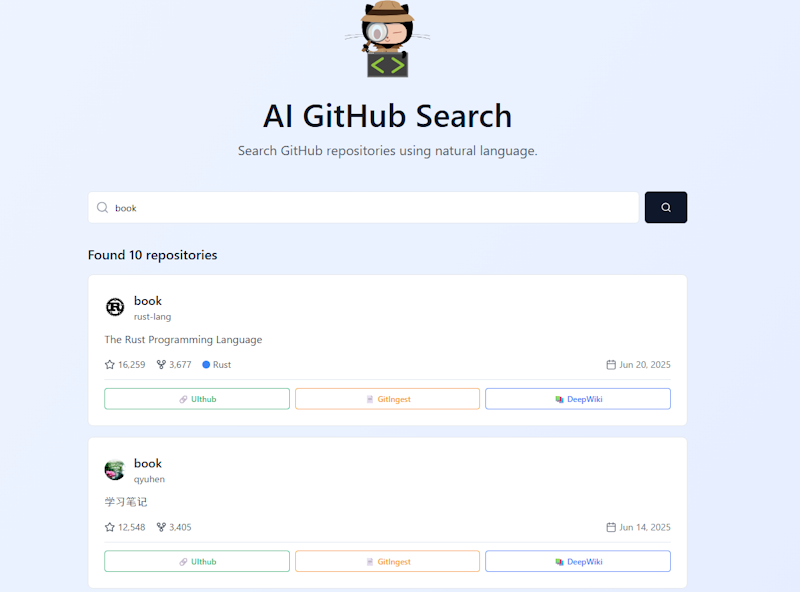
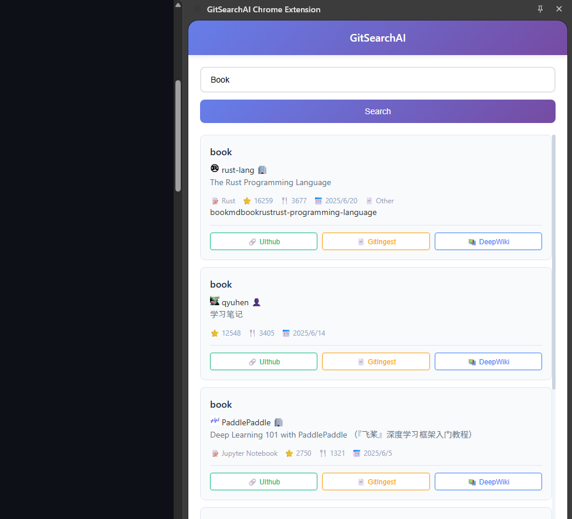

# GitSearchAI Chrome拡張機能

GitSearchAI.comウェブサイトを拡張し、追加のリポジトリ分析ツールへの便利なアクセスを提供するChrome拡張機能です。この拡張機能は外部サービスをGitSearchAIインターフェースに直接統合し、シームレスなリポジトリ探索を可能にします。

## 🚀 機能

### 主要機能
- **GitSearchAI.com統合**: GitSearchAI.comプラットフォームとのシームレスな統合
- **外部サービスリンク**: リポジトリ分析ツールへの素早いアクセス
- **サイドパネルインターフェース**: GitSearchAI.comアクセスのための便利なサイドパネル
- **クロスブラウザ互換性**: Chrome、Firefox、Edge、Safariをサポート

### 外部サービス統合
- **🔗 UIthub**: リポジトリUI分析のためのUIthub.comへの直接リンク
- **📄 GitIngest**: リポジトリコンテンツ処理のためのGitIngest.comへの素早いアクセス
- **📚 DeepWiki**: リポジトリドキュメント分析のためのDeepWiki.comとの統合

<p>
   
   
</p>

## 使い方

### 拡張機能アイコンをクリック

！[]（./ image/tutorial.gif）

### githubの下部にあるAI検索ボタンをクリック

！[]（./ image/tutorial2.gif）


## 📦 インストール

### Chrome Web Storeから
*近日公開予定 - 拡張機能はChrome Web Storeで利用可能になります*

### 手動インストール（開発用）
1. このリポジトリをクローンします：
   ```bash
   git clone https://github.com/yuyu1815/gitsearchai_chrome.git
   cd gitsearchai_chrome
   ```

2. 依存関係をインストールします：
   ```bash
   npm install
   ```

3. 拡張機能をビルドします：
   ```bash
   # Chrome用
   npm run build:chrome

   # その他のブラウザ用
   npm run build:firefox
   npm run build:edge
   npm run build:safari
   ```

4. Chromeに拡張機能を読み込みます：
   - Chromeを開き、`chrome://extensions/`に移動
   - 「デベロッパーモード」を有効にする
   - 「パッケージ化されていない拡張機能を読み込む」をクリックし、`dist/chrome`フォルダを選択

## 🛠️ 開発

### 前提条件
- Node.js（v16以上）
- npmまたはyarn
- テスト用のChromeブラウザ

### 開発環境のセットアップ
1. リポジトリをクローンし、依存関係をインストールします：
   ```bash
   git clone https://github.com/your-username/gitsearchai_chrome.git
   cd gitsearchai_chrome
   npm install
   ```

2. 開発サーバーを起動します：
   ```bash
   # Chrome用のホットリロード付き開発
   npm run dev:chrome

   # その他のブラウザ用
   npm run dev:firefox
   npm run dev:edge
   npm run dev:safari
   ```

3. ブラウザのデベロッパーモードで拡張機能を読み込みます

### プロジェクト構造
```
gitsearchai_chrome/
├── app/                        # 拡張機能のソースコード
│   ├── manifest.json          # 拡張機能のマニフェスト
│   ├── pages/                 # HTMLページ（ポップアップ、オプション、サイドパネル）
│   ├── scripts/               # TypeScriptソースファイル
│   │   ├── background.ts      # バックグラウンドサービスワーカー
│   │   ├── contentscript.ts   # Webページ用のコンテンツスクリプト
│   │   ├── lib/               # ユーティリティライブラリ
│   │   └── modules/           # 機能モジュール
│   ├── styles/                # CSSスタイルシート
│   ├── images/                # アイコンとアセット
│   ├── _locales/              # 国際化ファイル
│   └── tests/                 # テストファイル
├── dist/                      # ビルドされた拡張機能ファイル
├── package.json               # プロジェクトの依存関係
├── tsconfig.json              # TypeScript設定
└── webpack.config.js          # ビルド設定
```

### 利用可能なスクリプト
```bash
# 開発
npm run dev:chrome      # Chrome開発ビルド
npm run dev:firefox     # Firefox開発ビルド
npm run dev:edge        # Edge開発ビルド
npm run dev:safari      # Safari開発ビルド

# プロダクションビルド
npm run build:chrome    # Chromeプロダクションビルド
npm run build:firefox   # Firefoxプロダクションビルド
npm run build:edge      # Edgeプロダクションビルド
npm run build:safari    # Safariプロダクションビルド

# テスト
npm test               # ユニットテストの実行
npm run test:e2e       # エンドツーエンドテストの実行
```

## 🔧 設定

### 拡張機能の権限
この拡張機能には以下の権限が必要です：
- **storage**: ユーザー設定と拡張機能設定の保存
- **activeTab**: GitSearchAI.com統合のための現在アクティブなタブへのアクセス
- **scripting**: 外部サービスボタンを追加するためのスクリプト注入
- **contextMenus**: 素早いアクセスのためのコンテキストメニューアイテムの追加
- **sidePanel**: GitSearchAI.com用のサイドパネルインターフェースの表示

### ホスト権限
- `https://www.gitsearchai.com/*` - GitSearchAIプラットフォーム統合
- `https://github.com/*` - GitHubリポジトリリンク処理
- `https://gitlab.com/*` - GitLabリポジトリリンク処理
- `https://gitsearch-analytics-backend-*.herokuapp.com/*` - アナリティクスバックエンド

## 🎯 使用方法

### GitSearchAI.comへのアクセス
1. ブラウザのツールバーにあるGitSearchAI拡張機能アイコンをクリック
2. サイドパネルがGitSearchAI.comへの直接アクセスで開きます
3. GitSearchAI.comの検索機能を使用してリポジトリを検索

### 外部サービスリンクの使用
GitSearchAI.comでリポジトリ結果を表示している際、拡張機能は以下の便利なボタンを追加します：

1. **🔗 UIthub**: クリックしてUIthub.comでリポジトリのUIコンポーネントを分析
2. **📄 GitIngest**: クリックしてGitIngest.comでリポジトリコンテンツを処理
3. **📚 DeepWiki**: クリックしてDeepWiki.comでリポジトリドキュメントを探索

### サイドパネル機能
- 現在のページを離れることなくGitSearchAI.comに直接アクセス
- 外部分析ツールへの素早いナビゲーション
- リポジトリワークフローとのシームレスな統合

## 🧪 テスト

### テストの実行
```bash
# ユニットテスト
npm test

# エンドツーエンドテスト
npm run test:e2e

# テストカバレッジ
npm run test:coverage
```

### テスト構造
- **ユニットテスト**: `app/tests/unit/`に配置
- **統合テスト**: `app/tests/integration/`に配置
- **E2Eテスト**: `app/tests/e2e/`に配置

## 🔒 セキュリティとプライバシー

### データ処理
- すべての検索クエリは安全に処理されます
- ユーザーデータはChromeのストレージAPIを使用してローカルに保存
- ユーザーの同意なしに機密情報が送信されることはありません
- アナリティクスデータは匿名化され集約されます

### 権限の正当化
- **storage**: ユーザー設定と拡張機能設定の保存に必要
- **activeTab**: GitSearchAI.comとリポジトリページとの相互作用に必要
- **scripting**: GitSearchAI.comへの外部サービスボタンの注入に不可欠
- **contextMenus**: GitSearchAI.comへの便利な右クリックアクセスを提供
- **sidePanel**: メインGitSearchAI.comインターフェースを有効にする

## 🌐 ブラウザ互換性

| ブラウザ | サポート状況 | 備考 |
|---------|-------------|------|
| Chrome | ✅ 完全サポート | 主要開発ターゲット |
| Firefox | ✅ 完全サポート | webextension-toolboxによるクロスブラウザ互換性 |
| Edge | ✅ 完全サポート | ChromiumベースのEdge |
| Safari | ⚠️ 制限あり | 一部機能が制限される場合があります |

## 🤝 貢献

貢献を歓迎します！以下の手順に従ってください：

1. リポジトリをフォーク
2. 機能ブランチを作成：`git checkout -b feature/your-feature-name`
3. 変更を加えてテストを追加
4. すべてのテストが通ることを確認：`npm test`
5. 変更をコミット：`git commit -m 'Add some feature'`
6. ブランチにプッシュ：`git push origin feature/your-feature-name`
7. プルリクエストを提出

### 開発ガイドライン
- TypeScriptのベストプラクティスに従う
- 新機能には包括的なテストを記述
- API変更については文書を更新
- クロスブラウザ互換性を確保
- 既存のコードスタイルと規約に従う

## 📋 ロードマップ

### 今後の機能
- [ ] 追加の外部分析サービスとの統合
- [ ] 強化されたGitSearchAI.com統合機能
- [ ] 外部サービスボタンの改良されたユーザーインターフェース
- [ ] 追加のリポジトリ分析ツール
- [ ] カスタマイズ可能な外部サービス設定

### バージョン履歴
- **v1.0.0**: GitSearchAI.com統合と外部サービスリンク（UIthub、GitIngest、DeepWiki）を含む初回リリース

## 🐛 トラブルシューティング

### よくある問題

**拡張機能が読み込まれない**
- サポートされているブラウザバージョンを使用していることを確認
- デベロッパーモードが有効になっていることを確認
- すべての依存関係がインストールされていることを確認

**サイドパネルでGitSearchAI.comが読み込まれない**
- インターネット接続を確認
- 拡張機能に必要な権限があることを確認
- ページを更新し、拡張機能を再読み込みしてみる

**外部サービスボタンが表示されない**
- GitSearchAI.comにいることを確認
- 拡張機能が有効になっていることを確認
- GitSearchAI.comページを更新してみる

**パフォーマンスの問題**
- 設定で拡張機能のストレージをクリア
- 他の拡張機能を一時的に無効にする
- ブラウザコンソールでエラーメッセージを確認

### ヘルプの取得
- [Issues](https://github.com/your-username/gitsearchai_chrome/issues)ページを確認
- `app/`ディレクトリの文書を確認
- 拡張機能のオプションページからサポートに連絡

## 📄 ライセンス

このプロジェクトはMITライセンスの下でライセンスされています - 詳細は[LICENSE](LICENSE)ファイルを参照してください。

## 🙏 謝辞

- [webextension-toolbox](https://github.com/webextension-toolbox/webextension-toolbox)で構築
- AI検索アルゴリズムによって駆動
- インスピレーションと貢献をしてくれたオープンソースコミュニティに感謝

## 📞 サポート

サポート、機能リクエスト、バグレポートについては：
- GitHubでissueを作成
- [GitSearchAI.com](https://www.gitsearchai.com)を訪問
- 拡張機能の組み込みヘルプ文書を確認

---

**効率的なコード発見を愛する開発者のために❤️で作られました**
